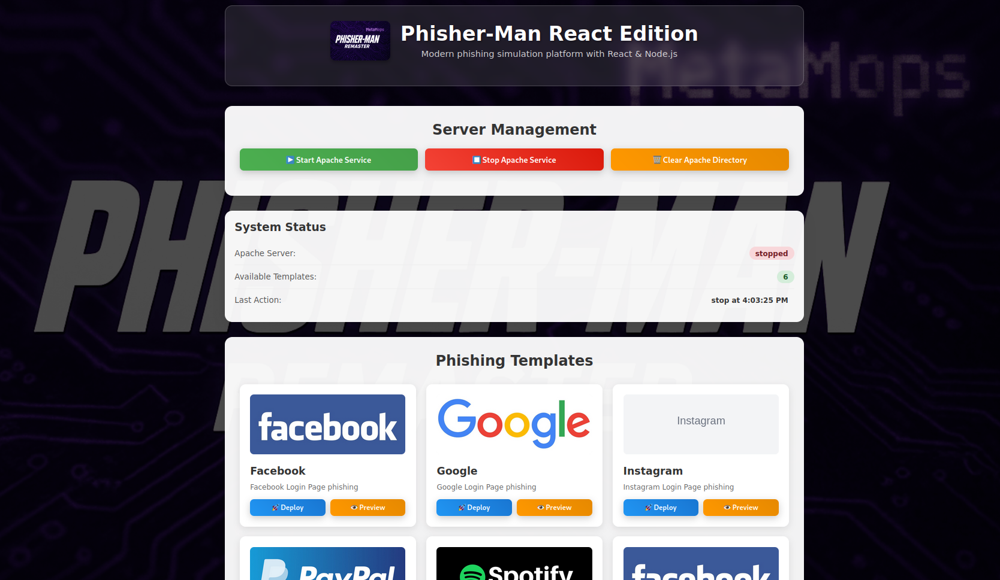
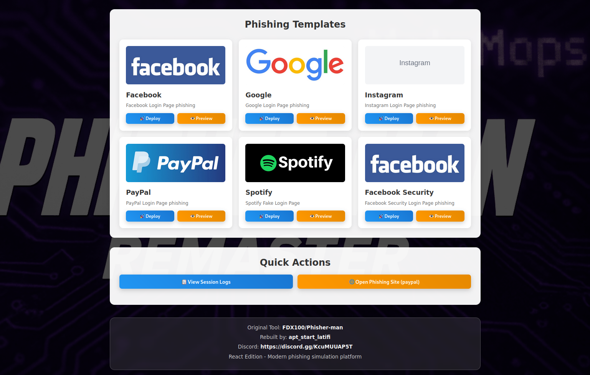

# Phisher-Man React Edition

## ⚠️ DISCLAIMER

<div style="background-color: #ffebee; border: 1px solid #f44336; border-radius: 8px; padding: 16px; margin: 20px 0;">

**🚨 IMPORTANT LEGAL NOTICE**

**This tool is for educational purposes and authorized testing only.**  
**Use only on systems you own or have explicit permission to test.**  

**The authors disclaim all liability for any misuse of this software.**  
**Users are solely responsible for compliance with all applicable laws and regulations.**  
**This is a remastered educational tool - any illegal use is entirely the user's responsibility.**

</div>

## 🔬 Research & Educational Purpose

This repository contains **educational materials for cybersecurity research and training purposes only**. The code demonstrates phishing attack vectors for defensive security education and awareness training.

### 📋 Authorized Use Cases
- **Academic Research**: University cybersecurity courses and research projects
- **Corporate Training**: Authorized security awareness training programs  
- **Penetration Testing**: Licensed security assessments with proper authorization
- **Defensive Research**: Improving detection and prevention mechanisms

### ❌ Prohibited Use Cases
- **Unauthorized Testing**: Testing on systems without explicit permission
- **Malicious Activities**: Using for actual phishing campaigns or credential theft
- **Public Deployment**: Deploying on public networks or production systems
- **Commercial Exploitation**: Using for unauthorized commercial purposes

**📖 [Read Full Research Statement](RESEARCH_STATEMENT.md) for detailed ethical guidelines and usage restrictions.**

## Credits
**Rebuilt by:** apt_start_latifi  
**Discord:** https://discord.gg/KcuMUUAP5T  
**Original Tool:** https://github.com/FDX100/Phisher-man

A modern React/Node.js version of the original Phisher-Man tool with improved UI and functionality.

**⚠️ Important:** The original repository had no license. This project is a UI rewrite and modernization of the original concept. All original phishing templates and concepts remain attributed to [FDX100](https://github.com/FDX100/Phisher-man).

## 📸 Preview

<div align="center">

### Dashboard & Templates
 

### Deployed Template


</div>

## 📚 Documentation

<div align="center" style="margin: 30px 0;">

### 📖 [Complete Documentation & Neocities](https://metamops-phisher-man-react.neocities.org/)

[](https://metamops-phisher-man-react.neocities.org/)

**Full technical documentation, installation guides, API reference, and more!**

</div>

## 🚀 Quick Start

### Prerequisites
- Linux/Unix system (Ubuntu/Debian recommended)
- sudo permissions
- Internet connection

### Installation & Setup
```bash
# Clone the repository
git clone https://github.com/MetaMops/Phisher-man-react.git
cd Phisher-man-react

# Run the setup script (installs everything automatically)
chmod +x start.sh
./start.sh
```

### Start the Application
```bash
# After setup is complete, start the server
sudo node server.js
```

### Access
- Open: `http://localhost:5000`
- Deploy templates and monitor captured data

## 📋 Available Templates
- **Facebook** - Facebook Login Page
- **Google** - Google Login Page  
- **Instagram** - Instagram Login Page
- **PayPal** - PayPal Login Page
- **Spotify** - Spotify Login Page
- **Facebook Security** - Facebook Security Page

## 🔧 Apache Configuration
If you encounter Apache issues, check the configuration file:
- **Location:** `/etc/apache2/sites-available/000-default.conf`
- **Document Root:** `/var/www/html/`

## 📚 Quick Documentation Links

<div style="display: grid; grid-template-columns: repeat(auto-fit, minmax(200px, 1fr)); gap: 10px; margin: 20px 0;">

<div style="border: 1px solid #e1e5e9; border-radius: 8px; padding: 15px; background: #f8f9fa; text-align: center;">

### 📸 [Preview Gallery](https://metamops-phisher-man-react.neocities.org/preview.html)
Screenshots & Interface

</div>

<div style="border: 1px solid #e1e5e9; border-radius: 8px; padding: 15px; background: #f8f9fa; text-align: center;">

### 🚀 [Installation Guide](https://metamops-phisher-man-react.neocities.org/installation.html)
Step-by-step Setup

</div>

<div style="border: 1px solid #e1e5e9; border-radius: 8px; padding: 15px; background: #f8f9fa; text-align: center;">

### ⚙️ [Configuration](https://metamops-phisher-man-react.neocities.org/configuration.html)
Advanced Settings

</div>

<div style="border: 1px solid #e1e5e9; border-radius: 8px; padding: 15px; background: #f8f9fa; text-align: center;">

### 🌐 [API Reference](https://metamops-phisher-man-react.neocities.org/api.html)
Complete API Docs

</div>

<div style="border: 1px solid #e1e5e9; border-radius: 8px; padding: 15px; background: #f8f9fa; text-align: center;">

### 🔧 [Troubleshooting](https://metamops-phisher-man-react.neocities.org/troubleshooting.html)
Common Issues

</div>

</div>

## ⚠️ Security Notice
**This tool is only for educational purposes and authorized testing.**  
Make sure you have proper authorization before using this tool for security testing.

## 🤝 Contributing
1. Fork the repository
2. Create a feature branch
3. Make your changes
4. Submit a pull request

## 📄 License
MIT License - see LICENSE file for details

---

**Rebuilt by:** apt_start_latifi  
**Discord Community:** https://discord.gg/KcuMUUAP5T  
**Original Tool:** https://github.com/FDX100/Phisher-man

**Note:** Original repository had no license. This is a UI modernization and React/Node.js rewrite of the original concept.